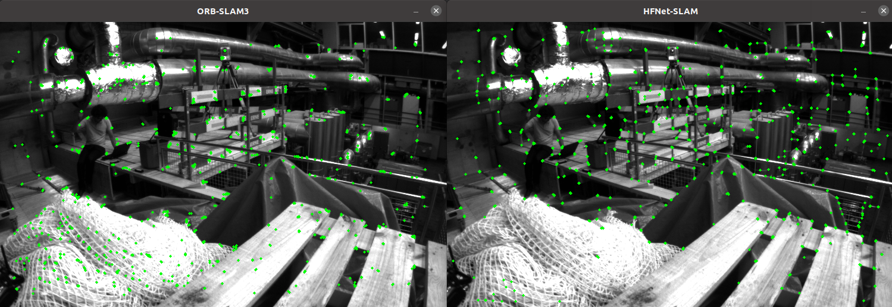

# HFNet-SLAM vs. ORB-SLAM3

This document is to compare the performance of HFNet-SLAM system with ORB-SLAM3 system in terms of feature matching, loop detection, calculation consumption, and so on.

## Build

```
chmod +x build.sh
bash build.sh
```

## Compare extractors

```
# EuRoC Dataset
./app/compare_extractors PATH_TO_EuRoC/MH01/mav0/cam0/data/ PATH_TO_MODEL

# TUM-VI Dataset
./app/compare_extractors PATH_TO_TUMVI/dataset-magistrale1_512_16/mav0/cam0/data/ PATH_TO_MODEL
```

`ORB-SLAM3` cost time: 12 ms; key point number: 1010;

`HFNet-SLAM (TensorFlow)` cost time: 19 ms; key point number: 1000;

`HFNet-SLAM (TensorRT)` cost time: 9 ms; key point number: 1000;



**Comment**: The feature extraction of HFNet-SLAM is more likely to extract features with significant textures. In terms of calculation cost, HFNet-SLAM (TensorFlow) > ORB-SLAM3 > HFNet-SLAM (TensorRT).

## Compare matchers

```
# EuRoC Dataset
./app/compare_matchers PATH_TO_EuRoC/MH01/mav0/cam0/data/ PATH_TO_MODEL Vocabulary/ORBvoc.txt

# TUM-VI Dataset
./app/compare_matchers PATH_TO_TUMVI/dataset-magistrale1_512_16/mav0/cam0/data/ PATH_TO_MODEL Vocabulary/ORBvoc.txt
```

`ORB-SLAM3` vocab costs time: 6.74ms; match costs time: 0.61ms; matches total number: 112; correct matches number: 95; match correct percentage: 84.8%;


`HFNet-SLAM` match costs time: 5.46ms; matches total number: 251; correct matches number: 232; match correct percentage: 92.4%;


**Comment**: The matching strategy in HFNet-SLAM has higher matching ability, and the SIMD technology improves the efficiency.

## Compare loop detection

```
# EuRoC Dataset
./app/compare_loop_detection PATH_TO_EuRoC/MH01/mav0/cam0/data/ PATH_TO_MODEL Vocabulary/ORBvoc.txt

# TUM-VI Dataset
./app/compare_loop_detection PATH_TO_TUMVI/dataset-magistrale1_512_16/mav0/cam0/data/ PATH_TO_MODEL Vocabulary/ORBvoc.txt
```

`ORB-SLAM3` Query cost time: 24426;


`HFNet-SLAM` Query cost time: 420;


**Comment**: The loop detection of HFNet-SLAM has higher recall and precision compared with ORB-SLAM3. Besides, it is more effective.

## Compare Runtime Performance:

Add `ADD_DEFINITIONS(-DREGISTER_TIMES)` to the root CMakeLists.txt and then rebuild the project to enable runtime analysis. 


**Comment**: In general, HFNet-SLAM is more effective than ORB-SLAM3 with the support of GPUs. This algorithm can run in real time at about 50 frames and 3-6 keyframes per second.